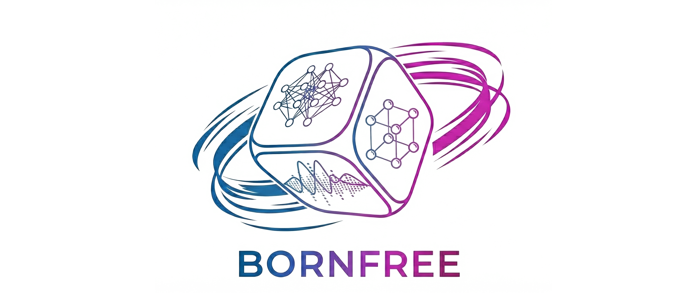

# BORNFREE
<p align="center">
  
</p>

**BornFree** is a beyond **B**orn-**O**ppenheimer **R**eal-space **N**eural-network **FR**amework for **E**nthalpy **E**xtremization, specialized implementation based on [DeepSolid](https://github.com/bytedance/DeepSolid), focusing on high-accuracy ab initio calculations of real solids using deep neural network wave function ansatzes. 

It is designed to handle various crystalline hydrogen structures under extreme pressure, treating both electrons and nuclei quantum mechanically within the constant pressure ensemble.

## Building and Installation

### Prerequisites
*   **Python 3.11** (only tested version - compatibility with other versions not guaranteed)
*   **CUDA 12.8** for GPU acceleration (optional but strongly recommended)
    - Requires CUDA 12.8+ for full NVIDIA package compatibility
*   **Linux** operating system

### Installation Steps

1.  **Environment Setup:**
    Create and activate a conda or virtual environment:
    ```bash
    # Using conda (recommended)
    conda create -n BornFree python=3.11
    conda activate BornFree
    ```

2.  **Install Dependencies:**
    Install the package in editable mode with all dependencies:
    ```bash
    bash env.sh
    ```

4.  **Verify Installation:**
    Check that JAX can detect your GPU (if available):
    ```bash
    python -c "import jax; print(jax.devices())"
    ```
    
    You should see output like `[CudaDevice(id=0)]` if GPU is available.

### Basic Usage

```bash
python bin/bornfree --config=<config_module>:<parameters>
```

### Example: Cmcm Structure at 130 GPa

To run a simulation of the Cmcm hydrogen structure with quantum nuclei under NPT:

```bash
python bin/bornfree --config=BornFree/config/read_cif.py:Hydrogen_cif/cmcm.cif,2.11,1,1,2,1024,quantum,0,NPT,partial_angle,130.0,50000,5000,300,1,0,1
```

### Configuration Parameters for `read_cif.py`

The configuration string consists of 17 comma-separated values:

1.  **`cif_path`**: Path to the CIF file (e.g., `Hydrogen_cif/cmcm.cif`)
    - Available structures: `cmcm.cif`, `p21c24.cif`, `p21c8.cif`, `p63m.cif`, `pca21.cif`
2.  **`rs`**: Wigner-Seitz radius in Bohr (controls density/pressure)
3.  **`Sx`**: Supercell size along x-direction (integer ≥ 1)
4.  **`Sy`**: Supercell size along y-direction (integer ≥ 1)
5.  **`Sz`**: Supercell size along z-direction (integer ≥ 1)
6.  **`batch_size`**
7.  **`nuclear_treatment`**: Nuclear treatment mode
    - `fixed`: Born-Oppenheimer approximation (classical nuclei, no NQEs, nuclei fixed)
    - `quantum`: Beyond Born-Oppenheimer (quantum nuclei with NQEs)
8.  **`infer`**: Inference mode (0 = training, 1 = inference only)
9.  **`ensemble`**: Thermodynamic ensemble
    - `NVT`: Canonical ensemble (constant volume)
    - `NPT`: Isothermal-isobaric ensemble (constant pressure)
10. **`lattice_mode`**: Lattice optimization mode
    - `angle`: Optimize both lattice vectors and angles
    - `partial_angle`: Optimize both lattice vectors, with fixed angles
    - `fixed`: Fix lattice parameters
11. **`pressure`**: Target pressure in GPa (relevant for NPT ensemble)
12. **`warmup_steps`**: Number of warmup steps
13. **`opt_steps`**: Number of wave function optimization steps per cycle
14. **`geo_opt_steps`**: Number of geometry optimization steps per cycle
15. **`is_rezero`**: Use ReZero scheme (0 = False, 1 = True)
16. **`local_sampling`**: Use local sampling during annealing (0 = False, 1 = True)
17. **`atom_center_dynamic`**: Learn atomic envelope centers (0 = False, 1 = True)

## Configuration System

BornFree uses a hierarchical configuration system:

*   **Base configuration:** `BornFree/base_config.py` defines the complete schema with default values
*   **System-specific configs:** Located in `BornFree/config/`
    - `read_cif.py`: General CIF file reader (recommended)
    - `bcc_config.py`: BCC structure specific settings
*   **Ensembles:**
    - **NVT**: Canonical ensemble (constant number, volume, temperature)
    - **NPT**: Isothermal-isobaric ensemble (constant number, pressure, temperature)
*   **Nuclear Treatments:**
    - **`fixed`**: Born-Oppenheimer approximation (electrons only, no NQEss)
    - **`quantum`**: Beyond Born-Oppenheimer (electrons + quantum nuclei, can be implemented either in NPT or in NVT)

## Project Structure

```
BornFree/
├── bin/
│   └── bornfree              # Main executable script
├── BornFree/                 # Main source code
│   ├── __init__.py
│   ├── base_config.py        # Configuration schema and defaults
│   ├── config/               # System-specific configurations
│   ├── network/              # Neural network architectures
│   ├── utils/                # Helper utilities
│   ├── mcmc/                 # MCMC sampling and annealing
│   ├── process_nvt.py        # NVT ensemble simulation loop
│   ├── process_npt.py        # NPT ensemble simulation loop
│   ├── loss.py               # Local energy calculation
│   ├── hamiltonian.py        # Hamiltonian operators
│   ├── hf.py                 # Hartree-Fock initialization
│   ├── init_guess.py         # Initial guess
│   ├── estimator.py          # xrd and rdf
│   ├── ewaldsum.py           # Ewald summation
│   ├── distance.py           # Distance calculations
│   ├── supercell.py          # Supercell construction
│   ├── checkpoint.py         # Checkpointing
│   └── constants.py          # Constants
├── Hydrogen_cif/             # Crystal structures (CIF format, in Bohr unit)
├── setup.py                  # Package installation (legacy)
├── pyproject.toml            # Modern package metadata
├── LICENSE                   # Apache 2.0 License
└── README.md                 # This file
```

## Citation

If you use BornFree in your research, please cite:

```bibtex
@article{chai_revisiting_,
  title = {Revisiting the Broken Symmetry Phase of Solid Hydrogen: A Neural Network Variational Monte Carlo Study},
  author = {Chai, Shengdu and Lin, Chen and Dong, Xinyang and Li, Yuqiang and Ouyang, Wanli and Wang, Lei and Xie, X. C.}
}

```

## License

This project is licensed under the Apache License 2.0 - see the [LICENSE](LICENSE) file for details.

## Acknowledgments

This project is based on [DeepSolid](https://github.com/bytedance/DeepSolid).